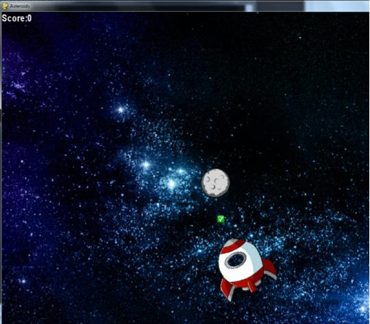

# Asteriods-Game
PyGame game with keyboard control, bitmapped images, and sound. Includes OOP
<p align="center">
  
</p>
<p align="center">
  </a>
</p>
<h2>Prerequisites</h2>
  <ul>
    <li>Python 2.7 or 3</li>
    <li>PyGame </li>
  </ul>

## Gameplay
The game begin with a rocket onscreen with a myriad of asteriods. When the arrow keys are pressed.

The objective of the game is to destroy all asteriod without crashing.

## Usage
```
python Asteroids-Main.py
```
```
./Asteroids-Main.py
```
## Author
* **Rebecca Louie** - - (https://github.com/rebecca-louie)
